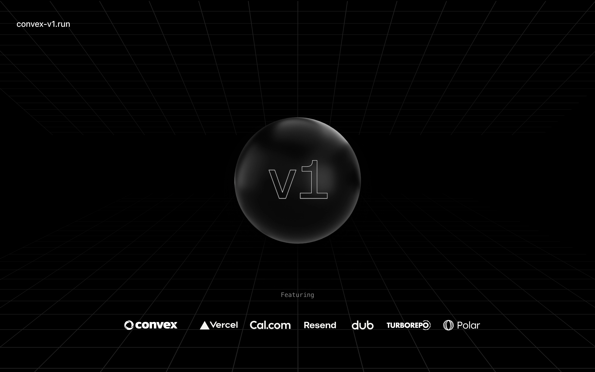

<p align="center">
	<h1 align="center"><b>Create v1</b></h1>
<p align="center">
    An open-source starter kit based on an <a href="https://v1.run">open-source starter kit</a> by <a href="https://midday.ai">Midday</a>. Ported to <a href="https://convex.dev">Convex</a>.
    <br />
    <br />
    <a href="https://convex-v1.run"><strong>Website</strong></a> ·
    <a href="https://github.com/get-convex/v1/issues"><strong>Issues</strong></a> ·
    <a href="#whats-included"><strong>What's included</strong></a> ·
    <a href="#prerequisites"><strong>Prerequisites</strong></a> ·
    <a href="#getting-started"><strong>Getting Started</strong></a> ·
    <a href="#deployment"><strong>Deploying to Production</strong></a>
  </p>
</p>

Everything you need to build a production ready SaaS, it's an opinionated stack
using Convex and the latest Next.js framework, a monorepo with a focus on code
reuse and best practices that will grow with your business.

## What's included

[Convex](https://convex.dev/) - Authentication, database, storage, background jobs, validated server actions, cache, rate limiting<br>
[Next.js](https://nextjs.org/) - Framework<br>
[Turborepo](https://turbo.build) - Build system<br>
[Biome](https://biomejs.dev) - Linter, formatter<br>
[TailwindCSS](https://tailwindcss.com/) - Styling<br>
[Shadcn](https://ui.shadcn.com/) - UI components<br>
[TypeScript](https://www.typescriptlang.org/) - Type safety<br>
[React Email](https://react.email/) - Email templates<br>
[Resend](https://resend.com/) - Email delivery<br>
[i18n](https://next-international.vercel.app/) - Internationalization<br>
[Sentry](https://sentry.io/) - Error handling/monitoring<br>
[OpenPanel](https://openpanel.dev/) - Analytics<br>
[Polar](https://polar.sh) - Billing<br>
[nuqs](https://nuqs.47ng.com/) - Type-safe search params state manager<br>
[next-themes](https://next-themes-example.vercel.app/) - Theme manager<br>

## Directory Structure

```
.
├── apps                         # App workspace
│    ├── app                     # App - your product
│    ├── web                     # Marketing site
│    └── ...
├── packages                     # Shared packages between apps
│    ├── analytics               # OpenPanel analytics
│    ├── backend                 # Convex (API, Auth, Database, Storage, Background Jobs, Validated Server Actions, Cache, Rate Limiting)
│    ├── email                   # React email library
│    ├── logger                  # Logger library
│    └── ui                      # Shared UI components (Shadcn)
├── tooling                      # are the shared configuration that are used by the apps and packages
│    └── typescript              # Shared TypeScript configuration
├── .cursorrules                 # Cursor rules specific to this project
├── biome.json                   # Biome configuration
├── turbo.json                   # Turbo configuration
├── LICENSE
└── README.md
```

## Prerequisites

### Bun

Bun is the only prerequisite you need to install before getting started.

To install Bun, please follow the official installation instructions:

[Bun Installation Guide](https://bun.sh/docs/installation)


## Getting Started

You have two options to create a new v1 project:

### Option 1: Using the CLI (Recommended)

To create a new v1 project using our CLI tool, run:

```bash
bun create @convex-dev/v1@latest
```

This command will guide you through the process of setting up your project, including:

1. Creating a new directory for your project
2. Cloning the v1 repository
3. Installing dependencies
4. Initializing a git repository
5. Setting up the Convex backend
6. Configuring authentication
7. Setting up environment variables
8. Adding test products to Polar
9. Seeding the database for subscriptions

After the setup is complete, you can start your development server by running:

```bash
cd your-project-name
bun dev
```

### Option 2: Manual Setup

If you prefer to set up the project manually, follow these steps:

1. Clone the repository:
   ```bash
   bunx degit get-convex/v1 v1
   cd v1
   ```

2. Install dependencies:
   ```bash
   bun install
   ```

3. Initialize git repository:
   ```bash
   git init && git commit -am 'initial commit'
   ```

4. Set up Convex backend:
   ```bash
   cd packages/backend
   npm run setup
   ```
   This will create a new Convex project. It will fail after project creation due to missing environment variables, which is expected at this stage.

5. Set up authentication:
   ```bash
   npx @convex-dev/auth
   ```
   Follow the prompts to configure authentication for your project.

6. Set up environment variables:
   If you prefer to set up services manually or want more control over the process, refer to the [Detailed Service Setup Instructions](#detailed-service-setup-instructions) section below.

7. Copy Convex environment variables:
   - Copy the contents of `packages/backend/.env`
   - Paste these variables into the environment variables panel in your Convex
     dashboard

8. Initialize Polar products and seed database:
   ```bash
   cd packages/backend
   bunx convex run init
   ```

9. Start the development server:
   ```bash
   bun dev
   ```
   This starts everything in development mode (web, app, api, email).

   Alternatively, you can start specific parts of the application:
   - `bun dev:web`: starts the web app
   - `bun dev:app`: starts the app
   - `bun dev:convex`: starts the Convex API
   - `bun dev:email`: starts the email app

## Detailed Service Setup Instructions

<details>
<summary>Click to expand detailed setup instructions</summary>

If you choose to manually set up services and environment variables, follow these steps for each service:

### Convex

1. Create a new project at https://dashboard.convex.dev
2. Obtain your Convex URL from the dashboard under 'Settings' > 'URL & Deploy Key'
3. Add the following to `apps/web/.env` and `apps/app/.env`:
   ```
   # The Convex URL from the dashboard. It should look like 'https://example-123.convex.cloud'
   NEXT_PUBLIC_CONVEX_URL=https://foobar-42.convex.cloud
   ```

### OpenPanel

1. Create an account at https://openpanel.dev
2. Create a new project in the OpenPanel dashboard
3. Add the following to `apps/app/.env`:
   ```
   # The secret key from OpenPanel dashboard under 'Settings' > 'Projects'. Starts with 'sec_'
   OPENPANEL_SECRET_KEY=sec_foobarfoobarfoobarfoobar42
   ```
4. Add the following to `apps/web/.env` and `apps/app/.env`:
   ```
   # The client ID from OpenPanel dashboard under 'Settings' > 'Projects'
   NEXT_PUBLIC_OPENPANEL_CLIENT_ID=foo-bar-42-baz-qux-42
   ```

### Sentry

1. Set up a project on https://sentry.io
2. Add the following to `apps/app/.env`:
   ```
   # The DSN from Sentry dashboard under 'Settings' > 'Projects' > [Your Project] > 'Client Keys (DSN)'
   NEXT_PUBLIC_SENTRY_DSN=https://foobarfoobar42@foobar42.ingest.sentry.io/42424242

   # The auth token generated in Sentry dashboard under 'Settings' > 'Auth Tokens'
   SENTRY_AUTH_TOKEN=foobarfoobarfoobarfoobarfoobar42

   # Your Sentry organization slug, found in the URL when in your Sentry dashboard
   SENTRY_ORG=your-org-name

   # The name of your Sentry project
   SENTRY_PROJECT=your-project-name
   ```

### Resend

1. Create an account at https://resend.com
2. Add the following to `packages/backend/.env`:
   ```
   # The API key from Resend dashboard under 'API Keys'. Starts with 're_'
   RESEND_API_KEY=re_foobarfoobarfoobarfoobarfoobar42

   # (Optional) The email address you want to use as the sender for authentication emails
   # Make sure it's verified in your Resend account under 'Domains'
   RESEND_SENDER_EMAIL_AUTH=auth@yourdomain.com
   ```

### Polar

1. Set up an account at https://polar.sh
   _Note: If you're just testing, be sure to switch to Sandbox via the top left dropdown in the dashboard before proceeding._
2. Add the following to `packages/backend/.env`:
   ```
   # Generate this in Polar dashboard under 'Account' > 'Developer settings'

   # Required permissions:
   # products:read, products:write,
   # subscriptions:read, subscriptions:write,
   # customers:read, customers:write,
   # checkouts:read, checkouts:write,
   # checkout_links:read, checkout_links:write,
   # customer_portal:read, customer_portal:write,
   # customer_sessions:write
   POLAR_ORGANIZATION_TOKEN=polar_oat_foobarfoobarfoobarfoobarfoobar42

   # Create a webhook in Polar dashboard under 'Settings' > 'Webhooks'
   # The webhook should point to: https://your-convex-deployment.convex.site/polar/events
   POLAR_WEBHOOK_SECRET=whsec_foobarfoobarfoobarfoobarfoobar42
   ```

### Cal.com (Optional)

1. Set up your Cal.com account
2. Add the following to `apps/web/.env`:
   ```
   # Your public Cal.com link, e.g., 'https://cal.com/yourusername'
   NEXT_PUBLIC_CAL_LINK=https://cal.com/your-username
   ```

### Loops (Optional)

1. Set up an account at https://loops.so
2. Add the following to `packages/backend/.env`:
   ```
   # The ID of the Loops form you want to use, found in the Loops dashboard
   LOOPS_FORM_ID=foobarfoobar42
   ```

### Google Authentication

1. Set up Google OAuth 2.0 credentials following the guide at https://support.google.com/cloud/answer/6158849?hl=en
2. Add the following to `packages/backend/.env`:
   ```
   # The client ID from your Google OAuth 2.0 credentials
   AUTH_GOOGLE_ID=424242424242-foobarfoobarfoobarfoobar42.apps.googleusercontent.com

   # The client secret from your Google OAuth 2.0 credentials
   AUTH_GOOGLE_SECRET=GOCSPX-foobarfoobarfoobarfoobar42
   ```
3. Set up the authorized redirect URI in your Google Cloud Console:
   - Use your Convex deployment's HTTP Actions URL with the path '/api/auth/callback/google'
   - Example: 'https://your-convex-deployment.convex.site/api/auth/callback/google'
   - You can find your Convex deployment's HTTP Actions URL in the Convex dashboard under 'Settings' > 'URL & Deploy Key'
4. Add both http://localhost:3000 and http://localhost:3001 to the list of authorized JavaScript origins for local development.

After setting up all the required services and environment variables, proceed to step 7 in the Getting Started section to copy the Convex environment variables to your Convex dashboard.

For more detailed information on each component, refer to their respective documentation linked in the "What's included" section above.
</details>

## Deployment

To deploy your v1 project to production, follow these steps:

### Deploying to Vercel

This repo contains two Next.js apps, you can deploy one or both to Vercel. Each
would be a separate Vercel project.

Steps to deploy a Vercel project with Convex can be found
[here](https://docs.convex.dev/production/hosting/vercel#deploying-to-vercel).


### Production Environment Variables

- **NEXT_PUBLIC_APP_URL**
  _Optional for apps/web_
  This is the URL for your deployed app, e.g., `https://your-app.vercel.app`.
  It is used by the marketing site to link to the app.

- **NEXT_PUBLIC_CONVEX_URL**
  _Required for both apps_
  This is the URL for your deployed Convex instance, e.g.,
  `https://your-project-name.convex.cloud`.
