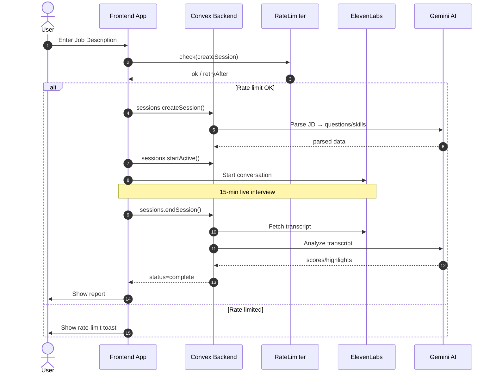

# Syntaxia

> **AI-powered technical interview platform** that conducts realistic phone screenings using conversational AI, providing candidates with actionable feedback and performance insights.

[](https://www.typescriptlang.org/)
[](https://convex.dev/)
[](https://tanstack.com/router)
[](https://bun.sh/)

---

## 🎯 Overview

Syntaxia transforms technical phone screening by combining **LLM-powered question generation** with **real-time conversational AI**. The platform parses job descriptions, generates tailored interview questions, and conducts 15-minute technical interviews that feel natural and engaging.

### Key Features

- 🤖 **Smart Question Generation** – Gemini AI analyzes job descriptions to create relevant technical questions
- 🎙️ **Conversational Interviews** – ElevenLabs AI conducts realistic voice interviews
- 📊 **Performance Analytics** – Detailed feedback with strengths, improvements, and next steps
- 💳 **Credit-Based System** – Flexible Polar.sh payment integration
- 🔐 **Enterprise Auth** – Clerk authentication with webhook-based user management
- ⚡ **Real-time Sync** – Convex backend ensures instant data updates

---

## 🏗️ Architecture

### Tech Stack

| Layer | Technology | Purpose |
|-------|-----------|---------|
| **Frontend** | TanStack Router + React 19 | Type-safe routing, modern React features |
| **Backend** | Convex | Real-time database, serverless functions |
| **AI/ML** | Gemini AI + ElevenLabs | Job parsing, conversational interviews |
| **Auth** | Clerk | User management, webhooks, JWT |
| **Payments** | Polar.sh | Credit purchases, webhook handling |
| **Analytics** | PostHog | User behavior, performance tracking |
| **UI** | Tailwind CSS 4 + shadcn/ui | Utility-first styling, accessible components |
| **Monorepo** | Turborepo + Bun workspaces | Fast builds, efficient dependency management |

### Project Structure

```
syntaxia/
├── apps/
│   ├── app/              # Main TanStack Router application
│   │   ├── src/
│   │   │   ├── routes/   # File-based routing
│   │   │   ├── components/
│   │   │   └── utils/
│   │   └── package.json
│   └── web/              # Marketing site (Astro)
│       └── src/
│
├── packages/
│   ├── backend/          # Convex backend
│   │   ├── convex/
│   │   │   ├── schema.ts      # Database schema
│   │   │   ├── sessions.ts    # Interview sessions
│   │   │   ├── credits.ts     # Credit management
│   │   │   ├── webhooks/      # Clerk + Polar webhooks
│   │   │   └── http/          # HTTP endpoints
│   │   └── package.json
│   │
│   ├── shared/           # Shared TypeScript types
│   ├── ui/               # shadcn/ui components
│   └── logger/           # Logging utilities
│
├── docs/
│   ├── architecture/     # System design documents
│   ├── convex-best-practices.md
│   └── performance-improvements.md
│
├── scripts/              # Development automation
└── tooling/              # Build configurations
```

---

## 🚀 Quick Start

### Prerequisites

- **Bun** 1.2+ (preferred) or Node.js 22+
- **Git**

### Installation

```bash
# Clone the repository
git clone https://github.com/victorpatru/syntaxia.git
cd syntaxia

# Install dependencies
bun install

# Setup git hooks (auto-generates Convex types)
bun run setup-hooks

# Setup backend environment
cd packages/backend
bun run setup
```

### Development

```bash
# Start all services (app + backend)
bun run dev

# Start specific apps
bun run dev:app      # Main application
bun run dev:web      # Marketing site
```

### Available Commands

```bash
bun run build        # Build all packages
bun run test         # Run test suites
bun run lint         # Lint all code
bun run format       # Format with Biome
bun run typecheck    # Type-check TypeScript
```

---

## 📚 Documentation

### Core Documentation

- **[Development Guide](./DEVELOPMENT.md)** – Setup, workflows, troubleshooting
- **[System Architecture](./docs/architecture/system-architecture.md)** – Sequence diagrams, data flow
- **[Convex Best Practices](./docs/convex-best-practices.md)** – Backend patterns, optimization tips
- **[Performance Improvements](./docs/performance-improvements.md)** – Bundle optimization, loading strategies

### Technical Deep Dives

<details>
<summary><b>Interview Flow Sequence</b></summary>



</details>

<details>
<summary><b>Database Schema Highlights</b></summary>

**Key Tables:**
- `users` – Clerk user sync, credit balances
- `sessions` – Interview lifecycle (setup → active → analyzing → complete)
- `creditsLog` – Audit trail for all credit transactions
- `webhookEvents` – Idempotent webhook processing

**Indexes:**
- `by_clerkUserId` – Fast user lookups
- `by_status_and_creationTime` – Efficient session queries
- `by_user_and_creationTime` – User session history

</details>

<details>
<summary><b>Performance Optimizations</b></summary>

**Current Metrics:**
- FCP: 5.17s → Target: <2.0s
- LCP: 4.91s → Target: <2.5s
- Bundle: 729kB → Target: <500kB

**Implemented Strategies:**
- Route-based code splitting
- Deferred PostHog initialization
- Manual bundle chunking (vendor, auth, interview)
- Resource preloading for critical assets

See [performance-improvements.md](./docs/performance-improvements.md) for details.

</details>

---

## 🛠️ Key Technical Decisions

### Why Convex?

**Real-time by default** – No manual socket management, instant UI updates  
**Type-safe backend** – Generated TypeScript types from schema  
**Serverless simplicity** – No infrastructure management, auto-scaling  
**Optimistic updates** – Built-in caching and conflict resolution

### Why TanStack Router?

**Type-safe routing** – Compile-time route validation  
**File-based routing** – Intuitive structure, automatic code splitting  
**Built-in data loading** – Loaders, actions, SSR support  
**Modern patterns** – Search params, layout routes, pending states

### Why Monorepo?

**Shared types** – Single source of truth for data models  
**Atomic changes** – Update frontend + backend in one PR  
**Code reuse** – Shared UI components, utilities, validators  
**Faster iteration** – Turborepo caching, parallel builds
