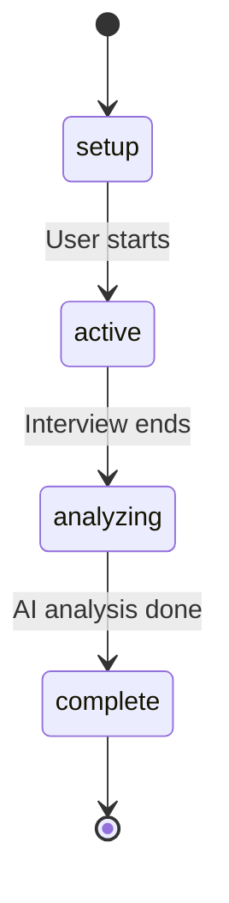
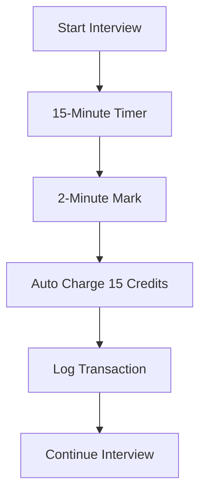

# 🎯 **Syntaxia - Main Flow**

Job description → AI parsing → Voice interview → Analysis → Report

---

## 🏗️ **Complete Application Flow**

```mermaid
flowchart TD
    A[Interview Start] --> B{Check Existing Session?}
    B -->|Has Active| C[Redirect to Current Phase]
    B -->|No Active| D[Job Description Input]

    D --> E{Credits ≥ 15?}
    E -->|No| F[Buy Credits]
    E -->|Yes| G[Create Session]

    G --> H[Setup Phase]
    H --> I[AI Parses JD]
    I --> J[Generates Questions]
    J --> K[Navigate to Session]

    K --> L[Active Interview]
    L --> M[ElevenLabs Voice]
    M --> N[15-Minute Timer]
    N --> O[Voice Q&A]
    O --> P{End Interview}

    P --> Q[End Session]
    Q --> R[Analysis Phase]
    R --> S[AI Analyzes Transcript]
    S --> T[Generate Scores]
    T --> U[Final Report]

    C -->|setup| H
    C -->|active| L
    C -->|analyzing| R
    C -->|complete| U

    classDef phase fill:#1a1a1a,stroke:#00ff41,stroke-width:2px
    classDef decision fill:#3a3a1a,stroke:#ffb000,stroke-width:2px

    class A,D,G,H,I,J,K,L,M,N,O,Q,R,S,T,U phase
    class B,E,P decision
```

---

## 🔄 **Session States**

---

## 💰 **Credit Flow**

---

*That's the system. Code tells the rest.* 🎯
