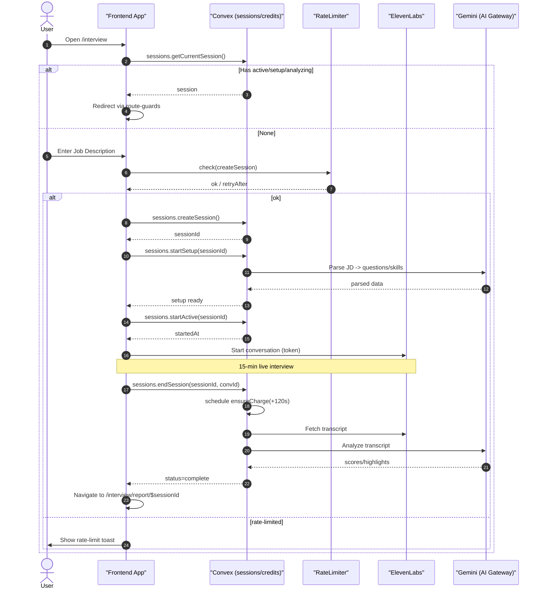

# Syntaxia System Architecture

## Interview Flow Sequence

## System Components

- **Frontend App**: TanStack Router application handling user interface
- **Convex**: Backend handling sessions, credits, and data persistence
- **RateLimiter**: Request throttling and abuse prevention
- **ElevenLabs**: Conversational AI for conducting interviews
- **Gemini (AI Gateway)**: Job description parsing and transcript analysis